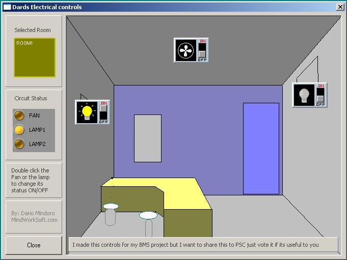



## Electrical control

### Description

Another control that I made for electrical controlling program, the is an animated button representing electric fan, lamp, LED and room. I used this controls for my BMS (Building Management System), for those who like my control here just give me a vote, thanks!
 
### More Info
 

             |
---                |---
**Submitted On**   |2006-06-10 16:20:02
**By**             |[Dario Mindoro](https://github.com/Planet-Source-Code/PSCIndex/blob/master/ByAuthor/dario-mindoro.md)
**Level**          |Advanced
**User Rating**    |4.9 (34 globes from 7 users)
**Compatibility**  |VB 6\.0
**Category**       |[Custom Controls/ Forms/  Menus](https://github.com/Planet-Source-Code/PSCIndex/blob/master/ByCategory/custom-controls-forms-menus__1-4.md)
**World**          |[Visual Basic](https://github.com/Planet-Source-Code/PSCIndex/blob/master/ByWorld/visual-basic.md)
**Archive File**   |[Electrical1999996102006\.zip](https://github.com/Planet-Source-Code/dario-mindoro-electrical-control__1-65627/archive/master.zip)

